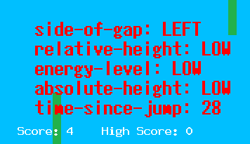
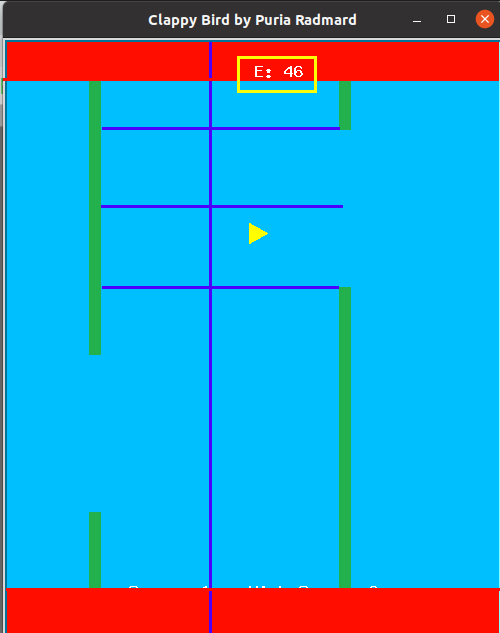

# Clappy Bird: an exercise in episodic MDP

Here, I allow an agent to develop an optimal policy for the game Clappy Bird (definitely not the same game as Flappy Bird)
The objective of the game is to avoid hitting pipes by jumping at the right time. However, jumping also takes energy, and when the player's energy is lower than the energy cost to jump, the action does nothing. Energy is gained back at a constant rate
Hitting the bottom or top of the screen also kills the player.


## Reinforcement Learning considerations



Rewards and configuration is  based on the attributes defined for the environment and for the agent given at the start of the `clappy_bird.py` script. For example:

For example:
```python
env = Environment(
    tube_v=10, g=-50, death_reward=-10, score_reward=2, low_energy_reward=-0.1
)

agent = Agent(jump_speed=30, jump_cost=20, stamina=0.75, discount_rate=0.9, avi=bird)
```
Tells us that tubes whizz by at 10 units per timestep, gravity is 5 times that, the penalty for dying is 10, the score for each set of pipes passed (i.e. one point gained by the player) is 2, and the penalty for each timestemp spent in low energy is -0.1 (low energy defined as 1.5*jump_cost).

It also defines the vertical speed immediately after jumping, the energy cost to jump, the energy points gained back every timestemp, and the discount rate of the MDP agent.

The `avi` argument relates to the graphics. I am trying to develop a headless version of the game, which will allow for faster training.

At each timestep, the agent has two options, jump or do not jump. This makes for fairly easy policy: 
$\pi$(a|s) can therefore be represented by a single number: the probability of jumping at this timestep, given the state at that step.

The state summaries are given in the screenshot above. There are 5 deciders: side of the gap the agent is on (2 possible), its height relative to the next pipe (4 possible), its energy level (3 possible), its absolute height (3 possible), and the number of timesteps since its last jump (technically infinite, but really ~25 possible).

Side of gap, and absolute and relative height encode the agent's danger of death, energy level its energy level, and number of steps since last jump encodes the energy and vertical speed of the agent.

At each time step, the state is calculated and stored in the array `agent.S` (alongside the action - taken after the state is found - in `agent.A`, and the subsequent reward - found last of all - in `agent.R`).
The entries to `agent.S` are dictionaries as such:

```python
{
    'side-of-gap': 'LEFT',
    'relative-height': 'HIGH',
    'energy-level': 'LOW',
    'absolute-height': 'MID',
    'time-since-jump': 1
}
```
### Visualisation of the state calculations



# Running the training process

First, some linux users may have to run:
```
export DISPLAY=$(w -h $USER | awk '$2 ~ /:[0-9.]*/{print $2}')
```
in this directory to support the graphics for the turtle python package

Second, you will need to set up a Grakn keyspace, which is used to save the graphs of each run persistently ater the terminal state of that run.